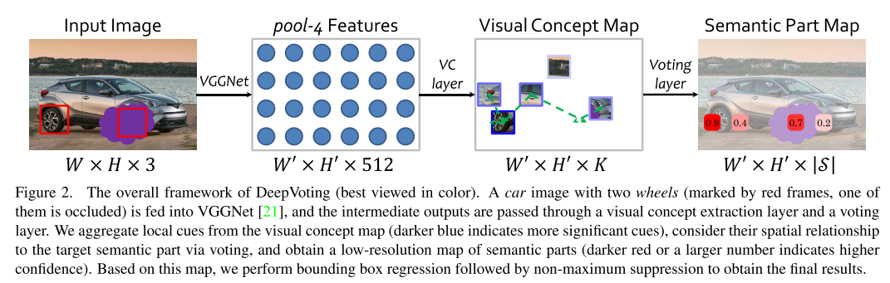
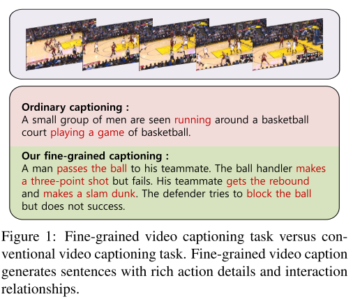

# Ideas

> This is the summary of new ideas in CVPR 2018.  This summary is based on author. If you have different idea, ignore this summary and hold on your own idea.

## Graph Generation Network

> A deep learning network generates a graph which contains the node and edges.

- Dynamic Graph Generation Network: Generating Relational Knowledge from Diagrams
  - This is a work for object detection and matching.
  - Author create a dynamic network for solving matching problems
- Some Related Work:
  - [GraphRNN: A Deep Generative Model for Graphs](https://duvenaud.github.io/learn-discrete/slides/graphrnn.pdf) ([Code](https://github.com/JiaxuanYou/graph-generation) [Paper](https://arxiv.org/pdf/1802.08773))

## Point Cloud Auto Encoder

> As we know, point cloud is hard to express. 

- FoldingNet: Point Cloud Auto-encoder via Deep Grid Deformation [[Code]()]

> 

## Point Cloud Segmentation & Recognition

- Attentional ShapeContextNet for Point Cloud Recognition
  - 
  - 
  - 

## Weak Supervision

- Bootstrapping the Performance ofWebly Supervised Semantic Segmentation [[code](https://github.com/ascust/BDWSS)]

  

  

## Image Segmentation

- DenseASPP for Semantic Segmentation in Street Scenes
  - 
  - 

## RGB Object Detection

- DeepVoting: A Robust and Explainable Deep Network for Semantic Part Detection under Partial Occlusion [[VehicleSemanticPart dataset](https://drive.google.com/file/d/1FU6Jw27yUj5XIVRt1Gj9z6Fb064wI3UE/view?usp=sharing)]
  - 
  - 
  -  
  - 

## RGB-D Object Detection

> RGB-D camera can output two kind of images: RGB Image and Depth Image. Combining these images can leads to better object detection or segmentation.

- Progressively Complementarity-aware Fusion Network for RGB-D Salient Object Detection
  - 
  - 

## Face Recognition

- Dynamic Feature Learning for Partial Face Recognition
  - 
  - 
  - 

## Scene Text Detection & Recognition

- Geometry-Aware Scene Text Detection with Instance Transformation Network
  - 
  - 

## Dense object tracking

> Object tracking is a fundamental and hard problems. Lots of great work are proposed these years. Dense object tracking is more difficult.

- Towards dense object tracking in a 2D honeybee hive 
  - 
  - 
  - 

## 3D Point Cloud Segmentation

- SPLATNet: Sparse Lattice Networks for Point Cloud Processing [[code](https://github.com/NVlabs/splatnet)]
  - 
  - 

## 3D Point Cloud Classification

- A Network Architecture for Point Cloud Classification via Automatic Depth Images Generation

  - > A network for 3D Point Cloud Projection whose result is used for classification.
    >
    > My ideas:
    >
    > - Automatic multiple projection (Find the 4 best projection plane which can recover 3D Point Cloud accurately)
    > - Use the proposed projection plane for 3D Point Cloud Segmentation

  - 

  - 

## 3D Point Cloud Reflection Removing

- Reflection Removal for Large-Scale 3D Point Cloud
  - 
  - 
  - 

## Human Pose Estimation & Tracking

- PoseTrack: A Benchmark for Human Pose Estimation and Tracking [[dataset](https://posetrack.net/)]
  - 
  - 

## Action Recognition

- Recognizing Human Actions as the Evolution of Pose Estimation Maps

  - 
  - 
  - 

- Temporal Deformable Residual Networks for Action Segmentation in Videos

  - > Action Segmentation in Temporal Space

  - 

  - 

- Unsupervised Learning and Segmentation of Complex Activities from Video

  - 
  - 

## 3D Map Reconstruction

- InLoc: Indoor Visual Localization with Dense Matching and View Synthesis [[code](http://www.ok.sc.e.titech.ac.jp/INLOC/), [dataset](http://www.ok.sc.e.titech.ac.jp/INLOC/)] 
  - 

## 3D Face Reconstruction

- Disentangling Features in 3D Face Shapes for Joint Face Reconstruction and Recognition 

  - 
  - 

- Alive Caricature from 2D to 3D [[dataset](https://github.com/QianyiWu/ Caricature-Data)]

  - 

  - 

  - 

## Style Transfering

- Learning to Sketch with Shortcut Cycle Consistency 

  - > Translating object image to a sketch

  - 

  - 

- PairedCycleGAN: Asymmetric Style Transfer for Applying and Removing Makeup

  - 
  - 
  - 

## Distort Recover

- Distort-and-Recover: Color Enhancement using Deep Reinforcement Learning [[code](t https://sites.google.com/view/distort-and-recover/)]
  - 
  - 
- Deep Video Super-Resolution Network Using Dynamic Upsampling Filters Without Explicit Motion Compensation [[code](https:// github.com/yhjo09/VSR-DUF), [dataset](https://media.xiph.org/video/derf/)]
  - 
  - 
  - 
- Missing Slice Recovery for Tensors Using a Low-rank Model in Embedded Space [[code](https://sites.google.com/site/yokotatsuya/ home/software)]
  - 

## Video Captioning

- Fine-grained Video Captioning for Sports Narrative 
  - 
  - 

## Image Captioning

- Neural Baby Talk [[code](https://github.com/jiasenlu/NeuralBabyTalk)]
  - 
  - 
  -        

## Visual Question Answering

> Visual Question Answering is a sub-field of sequence-to-sequence translation problem which includes 3 objects (or more in the future): images, words, actions.

- Vision-and-Language Navigation: Interpreting visually-grounded navigation instructions in real environments [[project](https://bringmeaspoon.org/), [dataset](https://niessner.github.io/Matterport/), [code](https://github.com/peteanderson80/Matterport3DSimulator)]

  - 
  - 
  - 

- Don’t Just Assume; Look and Answer: Overcoming Priors for Visual Question Answering [[project](https://www.cc.gatech.edu/~aagrawal307/vqa-cp/), [dataset](https://www.cc.gatech.edu/~aagrawal307/vqa-cp/) ]

  - 
  - 

- Show Me a Story: Towards Coherent neural story illustration

  - > Convert Sentence to Image

  - 

  - 

  - 

## Frame Estimation

- Globally Optimal Inlier Set Maximization for Atlanta Frame Estimation Kyungdon
  - 
  - 